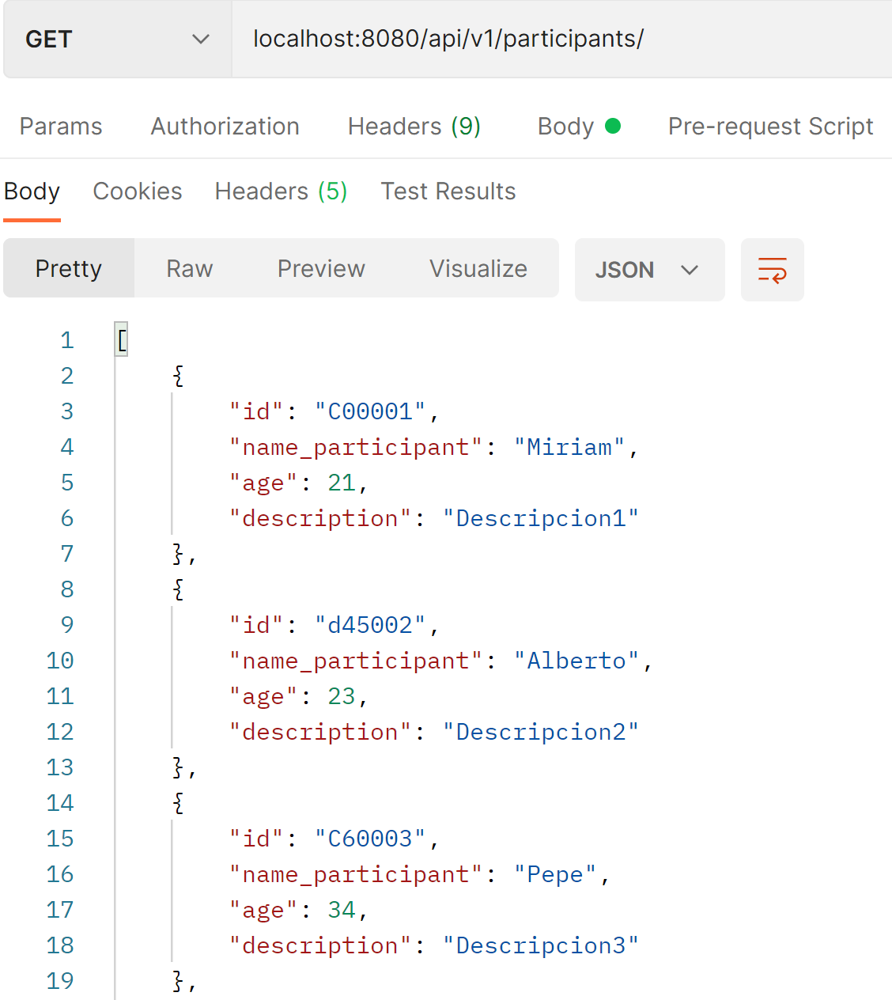
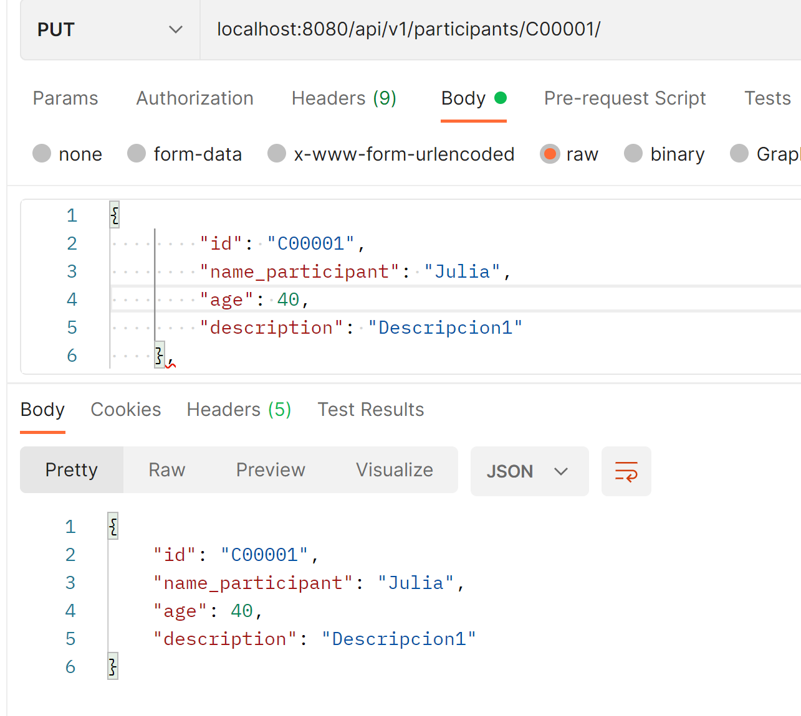
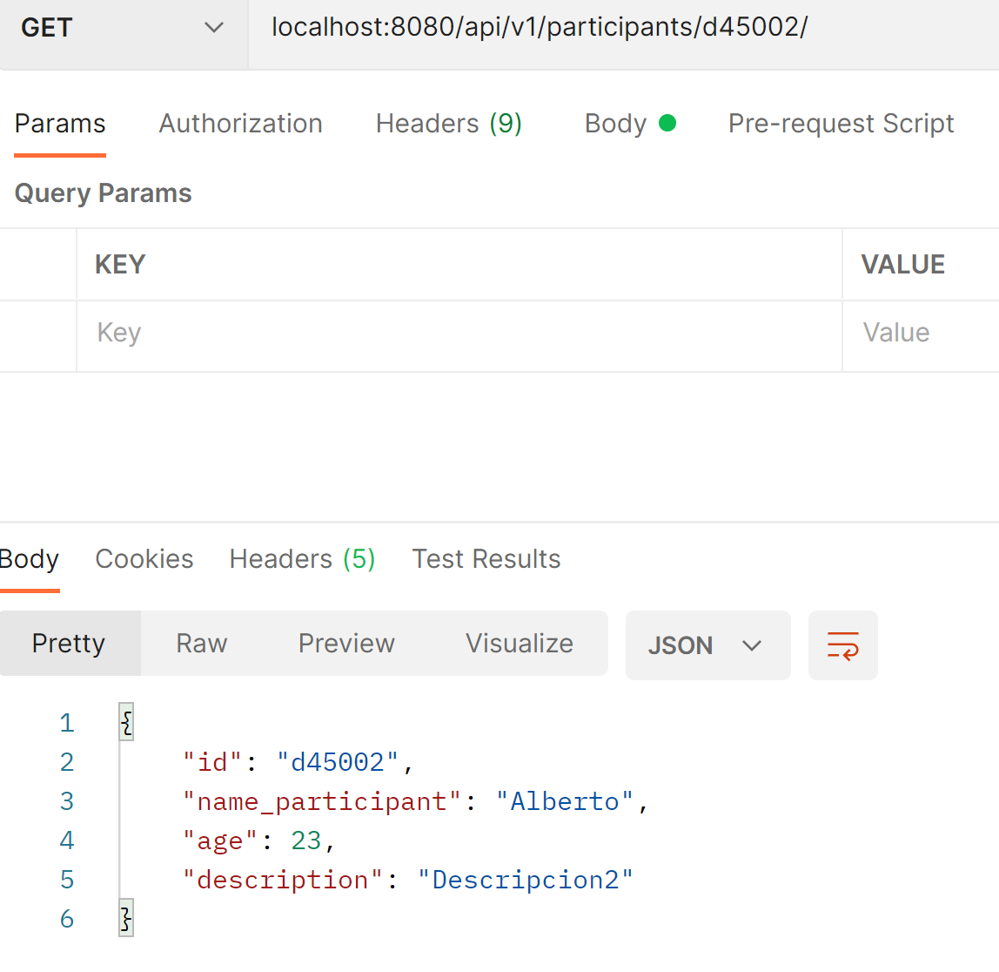

# Práctica Persistencia de Queries
Miriam Colino Ruipérez-201804334 3ºA GITT 

En esta práctica se pedía un desarrollo de una App de Spring Boot que incluya una funcionalidad que permita persistir información utilizando la librería Spring Data JDBC con una base de datos H2. El módulo de persistencia debe incluir las operaciones (INSERT, UPDATE,  SELECT y DELETE)
Las operaciones debe de incluir como mínimo dos operaciones “JOINS”  utilizando la anotación @Query.

- He dividido las carpetas en controller, model, repository y service. En la carpeta resources-database se encuentra la data.sql y el squema.sql

- He creado una clase Participant (simulando un supuesto concurso de Repsol) con atributos: id, name_participant, age y description. Todos estos atributos son los usados en la tabla "PARTICIPANT".

- He usado un  @GetMapping para obtener todos los participantes del concurso, un @GetMapping con id del participante, un @PutMapping para modificar cualquier atributo de un objeto Participante y un @DeleteMapping para eliminarlo.

- Las dos operaciones con @Query utilizo el atributo id y edad.

#Ejemplos funcionalidad 
------------------------
- GET localhost:8080/api/v1/participants/
(se mostrarían los 9 introducidos)

- PUT localhost:8080/api/v1/participants/C00001/
Si modificamos el primer participante (Miriam) y le cambiamos el nombre y la edad, al hacer PUT se actualiza:

- DELETE localhost:8080/api/v1/participants/C00001/

al mostrar la lista completa, se nos ha eliminado el primero

- GET localhost:8080/api/v1/participants/d45002/ 
Mostramos el participante con el id introducido

